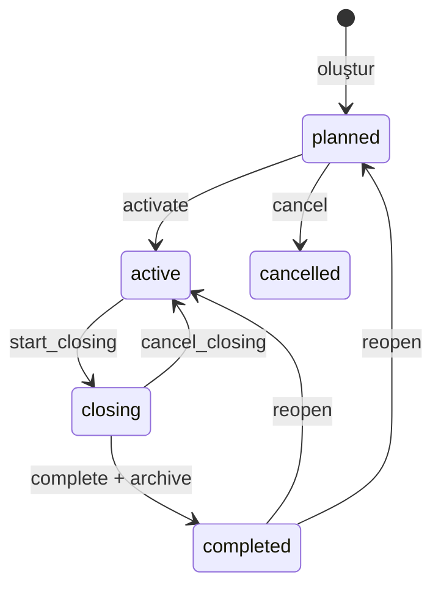

# Dönem Yaşam Döngüsü Mimarisi ve Veri Sözlüğü

Bu belge 21 Ağustos 2026 tarihindeki backend, frontend ve veritabanı sözleşmesini açıklar. Yeni dönemsel bir modül eklerken veya eski uyumluluk kodunu kaldırırken ana teknik referans budur. Üretim geçişi, yedekleme ve geri dönüş adımları için ayrıca [cutover runbook'unu](PERIOD_LIFECYCLE_CUTOVER_RUNBOOK.md) izleyin.

## 1. Temel model ve değişmezler

Sistemin dönem kaynağı `periods` tablosudur. Projenin güncel dönemi statü aramasıyla değil, `projects.current_period_id` pointer'ıyla belirlenir.

Korunması gereken değişmezler:

1. Bir projede en fazla bir `active` veya `closing` dönem bulunabilir.
2. `projects.current_period_id`, yalnız aynı projeye ait `active` veya `closing` dönemi gösterebilir.
3. `active` ve `closing` durumundaki dönem projenin güncel dönemidir; `planned`, `completed` ve `cancelled` güncel pointer olamaz.
4. Dönemsel operasyon kayıtlarında `project_id`, bağlı `period_id` kaydının `project_id` değeriyle aynı olmalıdır.
5. Yaşam döngüsü geçişleri doğrudan model güncellemesiyle değil `PeriodLifecycleService` üzerinden yapılır.
6. Tamamlanmış veya iptal edilmiş dönem normal mutation uçlarında salt okunurdur.
7. Her başarılı geçiş append-only `period_lifecycle_events` kaydı üretir.
8. Her başarılı tamamlama immutable ve sürümlü bir `period_archives` kaydı üretir.

`periods_one_current_status_per_project` benzersiz indeksi aynı projede ikinci `active/closing` satırı veritabanı seviyesinde reddeder. PostgreSQL, SQLite ve SQL Server'da filtreli/partial indeks; MySQL ve MariaDB'de yalnız current statüler için değer üreten nullable generated guard kolonu kullanılır. `current_period_id` foreign key'i yalnız dönem ID'sini doğruladığı için pointer'ın aynı projeyi ve doğru statüyü göstermesi lifecycle servisi ile `periods:audit --strict` tarafından ayrıca korunur. Kritik dönemsel tablolardaki proje/dönem eşleşmesi composite foreign key ile de zorunludur.

## 2. Yaşam döngüsü

`passive` yalnız geçiş dönemi uyumluluk durumudur. Canonical yeni kayıt durumu değildir ve stabilizasyon sonrasında kaldırılacaktır.

| Durum | Güncel pointer | Dönem ayarı | Yeni operasyon | Mevcut operasyonu sonuçlandırma | Arşiv modu | Canonical geçiş |
|---|---:|---:|---:|---:|---:|---|
| `planned` | Hayır | Evet | Hayır | Hayır | Hayır | `activate`, `cancel` |
| `passive` | Hayır | Evet | Hayır | Hayır | Hayır | Legacy: `activate`, `cancel` |
| `active` | Evet | Evet | Evet | Evet | Hayır | `start_closing` |
| `closing` | Evet | Hayır | Hayır | Evet | Hayır | `cancel_closing`, `complete` |
| `completed` | Hayır | Hayır | Hayır | Hayır | Evet | `reopen` |
| `cancelled` | Hayır | Hayır | Hayır | Hayır | Evet | Yok |

Capability değerlerinin backend kaynağı `PeriodLifecycleService::writeCapabilitiesForStatus()` metodudur. API bunları `lifecycle.write_capabilities` altında döndürür; frontend kendi iş kuralını üretmek yerine bu alanları kullanmalıdır.

### 2.1 Transaction ve eşzamanlılık sırası

Her geçiş aşağıdaki sırayla yürür:

1. İlgili proje `lockForUpdate()` ile kilitlenir.
2. Dönem aynı transaction içinde proje eşleşmesiyle kilitlenir.
3. Kaynak durum, pointer ve rakip `active/closing` dönem kontrol edilir.
4. Dönem, pointer ve gerekiyorsa başvuru penceresi birlikte güncellenir.
5. `lifecycle_version` artırılır ve append-only olay kaydı yazılır.
6. Transaction commit edildikten sonra başarılı geçiş telemetry olayı üretilir.

Deadlock halinde transaction üç kez denenir. Aynı projede eşzamanlı aktivasyon veya tamamlama yarışları bu kilit sırasıyla serileştirilir.

### 2.2 Geçiş ayrıntıları

- Oluşturma her zaman önce `planned` kayıt üretir.
- Aktivasyon pointer'ı döneme bağlar; başka güncel dönem varsa `409` döner.
- Kapanışı başlatma açık `application_windows` kaydını ve legacy proje başvuru bayrağını aynı transaction içinde kapatır.
- Kapanışı iptal etme dönemi yeniden `active` yapar; başvuru penceresini otomatik açmaz.
- Tamamlama readiness blocker varsa `422` ile bütünüyle rollback olur; arşiv, event ve statü değişikliği kalmaz.
- Başarılı tamamlama önce arşiv sürümünü üretir, sonra dönemi `completed` yapıp pointer'ı temizler.
- Yeniden açma yalnız `completed` dönem için, zorunlu gerekçeyle `planned` veya `active` hedefe yapılır.
- İptal yalnız `planned` veya legacy `passive` dönem içindir.

Backend, eski panel istemcileri için `active` durumdan doğrudan `complete` çağrısını transaction içinde önce `closing` durumuna geçirerek hâlâ destekler. Canonical panel akışında `complete` yalnız `closing` durumunda sunulur; bu uyumluluk yolu stabilizasyon sonrası kaldırma adayıdır.

## 3. Yazma politikası

Tüm dönemsel mutation uçları işlemin niteliğini `PeriodWriteAction` ile belirtir:

| Aksiyon | İzinli durumlar | Tipik kullanım |
|---|---|---|
| `configure_period` | `planned`, `passive`, `active` | dönem ayarı, başvuru formu ve dönem konfigürasyonu |
| `create_operation` | `active` | program, ödev, başvuru veya yeni operasyon kaydı oluşturma |
| `resolve_operation` | `active`, `closing` | mevcut başvuru, ödeme, teslim veya katılımcı sonucunu kesinleştirme |
| `archive_correction` | `completed`, `cancelled` ve özel yetki | kontrollü düzeltme yolu |

İzin verilmeyen dönemsel yazmalar HTTP `423` döndürür ve `period_lifecycle.write_rejected` olayını üretir. Arşiv düzeltmesinde canonical yetki `periods.archive.correct`, geçici uyumluluk alias'ı `periods.archive.update` değeridir.

Yeni bir mutation eklenirken yalnız frontend butonunu kapatmak yeterli değildir. Controller, servis, job ve komut gibi her backend yazma yolu `PeriodWritePolicy` üzerinden korunmalıdır.

## 4. Yetki ve scope sözleşmesi

Yetki kontrolü iki aşamalıdır:

1. Kullanıcının ilgili permission'a sahip olması.
2. Permission scope'unun dönemin `project_id` değerini kapsaması.

Proje tabanlı kabul edilen scope tipleri `all`, `own_projects`, `assigned_projects` ve `selected_projects` değerleridir. Bilinmeyen veya proje dışı scope fail-closed davranır.

| İşlem | Permission |
|---|---|
| Liste/detay/kapanış özeti/arşiv görüntüleme | `periods.view` |
| Dönem oluşturma | `periods.create` |
| Dönem bilgilerini güncelleme | `periods.update` |
| Aktivasyon | `periods.activate` |
| Kapanış hazırlığını başlatma | `periods.closing.start` |
| Kapanış hazırlığını iptal etme | `periods.closing.cancel` |
| Tamamlama ve arşivleme | `periods.complete` |
| Yeniden açma | `periods.reopen` |
| Planlanan dönemi iptal etme | `periods.cancel` |
| Arşiv düzeltme | `periods.archive.correct` |
| Arşiv bütünlüğünü doğrulama | `periods.archive.verify` |
| Dışa aktarma | `periods.export` |

`super_admin` tüm lifecycle permission'larını alır. `coordinator` varsayılan olarak activate, closing start/cancel, complete, cancel ve archive verify alır; `periods.reopen` ile `periods.archive.correct` kısıtlıdır. Custom rollerin nihai etkili permission ve scope'u `PermissionResolver` tarafından role scope, kullanıcı override ve legacy eşlemeler birleştirilerek hesaplanır.

API'nin `lifecycle.allowed_transitions` alanı yalnız durum matrisini değil, oturumdaki kullanıcının permission ve proje scope'unu da dikkate alır. Frontend geçiş butonlarını bu alan üzerinden üretir; backend her isteği yeniden doğrular.

## 5. HTTP API sözleşmesi

Aynı controller uçları hem `/api/admin` hem `/api/panel` prefix'i altında sunulur.

| Metot ve yol | Amaç |
|---|---|
| `GET /periods` | scope'lu dönem listesi |
| `GET /periods/export` | scope'lu dışa aktarma |
| `POST /periods` | varsayılan `planned` dönem oluşturma |
| `GET /periods/{id}` | dönem, lifecycle, timeline ve son arşiv özeti |
| `PUT /periods/{id}` | yalnız dönem detaylarını güncelleme |
| `POST /periods/{id}/activate` | aktivasyon |
| `POST /periods/{id}/closing/start` | kapanış hazırlığı |
| `POST /periods/{id}/closing/cancel` | kapanışı iptal etme |
| `POST /periods/{id}/complete` | readiness + arşiv + tamamlama |
| `POST /periods/{id}/reopen` | gerekçeli yeniden açma |
| `POST /periods/{id}/cancel` | planlanan dönemi iptal etme |
| `GET /periods/{id}/closure-summary` | canlı özet ve readiness sonucu |
| `GET /periods/{id}/archives` | arşiv sürümleri |
| `GET /periods/{id}/archives/{archiveId}` | snapshot dahil arşiv detayı |
| `POST /periods/{id}/archives/{archiveId}/verify` | canonical hash ve zincir doğrulama |

`PeriodResource` içindeki canonical alanlar:

- `status` ve aynı değeri taşıyan `lifecycle.status`;
- `lifecycle.version`, `is_current`, `is_archive_mode`;
- permission/scope filtreli `allowed_transitions`;
- backend kaynaklı `write_capabilities`;
- actor/time lifecycle alanları;
- `latest_archive` ve `archive_integrity_status`;
- detay ucunda `lifecycle_events`.

Generic update ucundaki `status` alanı yalnız mevcut değeri tekrar gönderen eski istemciler için kabul edilir; farklı değer `422` döner. Yeni istemci `status` göndermemelidir.

## 6. Çekirdek veri sözlüğü

### 6.1 `projects`

| Alan | Anlam / kısıt |
|---|---|
| `current_period_id` | Nullable FK `periods.id`, delete halinde null; unique indeks bir dönemin iki projede pointer olmasını engeller. Canonical güncel dönem kaynağıdır. |
| `application_open`, tarih, mülakat, quota alanları | Geçici legacy/uyumluluk yansımasıdır. Aktif dönemin `application_windows` kaydı authoritative olmalıdır. |

### 6.2 `periods`

| Alan | Anlam / kısıt |
|---|---|
| `project_id` | Dönemin sahibi proje; proje silinirse dönem cascade silinir. |
| `name`, `start_date`, `end_date` | Dönem kimliği ve takvim aralığı. Tarih çakışmaları audit warning'idir. |
| `credit_start_amount`, `credit_threshold` | Döneme ait kredi başlangıcı ve risk eşiği. |
| `status` | `planned`, `active`, `closing`, `completed`, `cancelled`, geçici `passive`. |
| `lifecycle_version` | Her durum/detay mutation'ında artan optimistic izleme sürümü. |
| `activated_*`, `closing_started_*`, `completed_*`, `reopened_*`, `cancelled_*` | Son ilgili geçişin zamanı ve aktörü; kullanıcı silinirse actor FK null olur. |

`(id, project_id)` benzersiz anahtar çifti, dönemsel tablolardaki composite foreign key'lerin hedefidir.

`periods_one_current_status_per_project` indeksi eklenmeden önce migration mevcut `active/closing` tekrarlarını denetler ve etkilenen proje ID'lerini bildirerek durur. Veri kararı verilmeden sessiz düzeltme veya pasifleştirme yapmaz.

### 6.3 `period_lifecycle_events`

Append-only denetim günlüğüdür. `period_id` ve `project_id` delete işlemlerini restrict eder.

| Alan | Anlam |
|---|---|
| `event_type` | `created`, `updated`, `activated`, `closing_started`, `closing_cancelled`, `completed`, `reopened`, `cancelled` veya backfill olayı. |
| `from_status`, `to_status` | Geçişin kaynak ve hedef durumu. |
| `actor_id` | İşlemi yapan kullanıcı; kullanıcı silinirse null. |
| `reason` | Gerekçe; reopen/cancel gibi riskli geçişlerde zorunlu olabilir. |
| `metadata_json` | Değişen alanlar, arşiv ID'si veya compatibility/backfill bağlamı. |
| `created_at` | Olay zamanı; `updated_at` yoktur. |

Model update ve delete işlemlerini reddeder. Event verisi operasyon loglarından farklı olarak kalıcı iş denetim kaydıdır.

### 6.4 `period_archives`

Her `(period_id, archive_version)` çifti benzersizdir. Dönem ve proje silme işlemleri restrict edilir.

| Alan | Anlam |
|---|---|
| `archive_version` | Dönem içindeki monoton arşiv sürümü. |
| `schema_version` | Snapshot sözleşmesi; güncel builder sürümü `2`. |
| `previous_archive_id`, `previous_hash` | Önceki sürüme bağlı hash zinciri. İlk sürümde null. |
| `summary_json`, `warnings_json`, `counts_json` | Kapanış anındaki okunabilir özet ve sayımlar. |
| `snapshot_json` | Proje, dönem ve dönemsel domain kayıtlarının canonical snapshot'ı. |
| `manifest_json` | Domain bazında kayıt sayısı, ID listesi ve digest. |
| `readiness_json` | Kapanış kontrollerinin sonuç, severity ve watermark fotoğrafı. |
| `override_reason` | Legacy backfill veya gelecekte onaylanmış override bağlamı. Mevcut normal complete akışında blocker override yoktur. |
| `correction_reason` | Reopen sonrasındaki yeni arşiv sürümünün düzeltme gerekçesi. |
| `integrity_hash` | Canonical JSON üzerinden SHA-256 hash. |
| `verification_status`, `verified_at`, `verified_by` | Son bütünlük kontrolünün operasyonel sonucu. |

Snapshot içeriği immutable'dır; düzeltme eski satırı değiştirmez, yeni arşiv sürümü üretir. Doğrulama alanları hash payload'ının parçası değildir ve `verify` işlemi tarafından güncellenebilir. Şema v1 arşivleri yalnız geriye dönük doğrulama için okunur; yeni arşivler v2 üretilir.

### 6.5 `application_windows`

Her `(project_id, period_id)` için en fazla bir başvuru penceresi vardır. Composite FK pencerenin dönemiyle projesinin eşleşmesini zorunlu kılar.

| Alan | Anlam |
|---|---|
| `is_open` | Operatörün açık/kapalı tercihi; etkin açıklık ayrıca proje/dönem durumu ve tarih aralığına bağlıdır. |
| `starts_at`, `ends_at` | Açıklık zaman aralığı. |
| `next_application_date` | Aktif dönemde kapalı başvuru için kullanıcıya gösterilecek sonraki tarih. |
| `has_interview`, `quota` | Döneme özel başvuru kuralları. |
| `change_note` | Operasyon notu. |
| `opened_*`, `closed_*`, `updated_by`, `status_changed_at` | Değişiklik denetim alanları. |

Bir pencere açılırken aynı projenin diğer açık pencereleri aynı kilitli transaction içinde kapatılır. Başvuru yalnız aktif proje + aktif dönem + açık tarih aralığında etkili biçimde açıktır. Kapanış hazırlığı pencereyi otomatik kapatır.

## 7. Dönemsel tablo sınıfları

Sınıflandırmanın runtime kaynağı `config/period_lifecycle.php` dosyasındaki `tables` haritasıdır. Audit ve archive builder bu açık envanteri kullanır.

### 7.1 Zorunlu dönemsel olgular

`participants`, `applications`, `programs`, `assignments`, `credit_logs`, `waitlist_invitations`, `application_windows`, `period_archives`, `period_lifecycle_events`.

Bu sınıfta null `period_id` kritik anomalidir. İlk dokuz operasyon/arşiv tablosunda `(period_id, project_id) -> periods(id, project_id)` composite FK bulunur. `applications.period_id` ve `programs.period_id` legacy nullable yapıdan `NOT NULL` yapıya geçirilmiştir.

### 7.2 Operasyonel inceleme

`certificates`, `financial_transactions`, `support_tickets`, `requests`, `kpd_appointments`, `kpd_reports`, `participant_mentor`.

Bu kayıtlar dönemle ilişkilendirilebilir; legacy veya özel süreçlerde null kalabilmeleri otomatik veri uydurma sebebi değildir. Audit bunları blocker yerine uyarı olarak raporlar. Yeni dönemsel işlem oluştururken mümkün olan her yerde açık `period_id` kullanılmalıdır.

### 7.3 Dönem veya proje-geneli içerik

`application_forms`, `digital_bohca`, `volunteer_opportunities`, `project_modules`, `eurodesk_projects`.

Null `period_id`, içeriğin proje genelinde geçerli olduğunu ifade edebilir. Kanıt olmadan güncel döneme backfill edilmez.

### 7.4 Dönem veya sistem-geneli içerik

`announcements`, `calendar_events`, `forum_posts`.

Null `period_id`, içerik türüne göre proje/sistem genelini ifade edebilir. Listeleme ve mutation scope'u controller sözleşmesiyle ayrıca korunur.

### 7.5 Dolaylı dönem kayıtları

`assignment_submissions`, `attendances`, `feedbacks`, `volunteer_applications`, `project_module_enrollments`, `reward_awards`, `internships`, `support_replies`, `program_photos`, `eurodesk_partnerships` doğrudan veya üst kayıtları üzerinden döneme bağlanır. Arşiv builder bu kayıtları parent ilişkisinden snapshot'a dahil eder.

## 8. Kapanış readiness sözleşmesi

Readiness her istek anında yeniden hesaplanır ve `watermark` ile dönem sürümü + kontrol sayımlarına bağlanır.

### Blocker

- `open_programs`: `scheduled` veya `active` program;
- `open_application_window`: açık başvuru penceresi;
- `unresolved_applications`: kesin karara bağlanmamış başvuru;
- `pending_financials`: `pending` veya `approved` finans kaydı;
- `unreviewed_assignment_submissions`: kesin sonucu bekleyen teslim;
- `missing_participant_outcomes`: dönem sonucu eksik katılımcı.

### Warning

- `open_kpd_work`;
- `open_support_or_requests`;
- `undelivered_certificates`;
- `missing_feedback`;
- `low_credit`.

Blocker sayısı sıfır değilse `complete` başarısızdır. Mevcut üründe override endpoint'i yoktur. Severity veya override politikası ürün sahibi kararı olmadan gevşetilmez.

## 9. Arşiv v2 kapsamı ve bütünlük

Arşiv builder:

1. Dönem ve proje kimliğini snapshot'a ekler.
2. Açıkça seçilmiş dönemsel domain kolonlarını deterministic ID sırasıyla toplar.
3. Dosya yollarını path + SHA-256 path digest yapısına çevirir; dosya binary içeriğini snapshot'a gömmez.
4. Dolaylı dönem kayıtlarını parent join ile toplar.
5. Her domain için `count`, `ids` ve canonical digest manifesti üretir.
6. Readiness, summary ve sayımları aynı hash payload'ına dahil eder.
7. Önceki sürüm hash'ini yeni sürüme bağlar.

`periods:verify-archives`, stored hash'i yeniden hesaplar ve v2 zincirini ilk sürüme kadar doğrular. Tek bir invalid sonuç komutu başarısız exit code ile bitirir ve error telemetry üretir.

## 10. Frontend sözleşmesi

Ana tip sözleşmesi `frontend/src/features/panel/pages/admin/periods/period-contract.ts`, ortak dönem seçimi ve arşiv uyarısı `frontend/src/components/shared/ProjectPeriodFilters.tsx` içindedir.

- `/panel/periods` liste/oluşturma/düzenleme ekranıdır; yeni dönem `planned` oluşur.
- `/panel/periods/[id]` backend'in `allowed_transitions` alanıyla çalışan dönem çalışma alanıdır.
- Çalışma alanı readiness blocker/warning listesini, timeline'ı, arşiv sürümlerini ve verify işlemini gösterir.
- Dönemsel modüller `write_capabilities` ile create/configure/resolve aksiyonlarını ayrı ayrı kapatır.
- `completed` ve `cancelled` seçiminde ortak `PeriodArchiveModeNotice` gösterilir.
- Proje dönem filtreleri `current_period` değerini authoritative kabul eder ve seçimi `project_id`/`period_id` query parametreleriyle taşır.

Frontend'deki `active_period` alias'ı ve statüden capability hesaplayan fallback yalnız eski backend uyumluluğudur. Backend payload'ı olmayan bir durumda güvenli görünüm sağlar; gerçek yetkilendirme değildir. Stabilizasyon sonrasında backend/frontend birlikte kaldırılmalıdır.

## 11. Operasyon, audit ve telemetry

### Geliştirme seed sözleşmesi

`ProjectSeeder` uygulamanın sabit altı KADEME projesini kurar. Dönemleri doğrudan `active` yazmak yerine `PeriodLifecycleService` ile `planned → active` geçirir; böylece current pointer ve lifecycle olayları normal runtime sözleşmesiyle oluşur. Her proje için dönemsel `application_windows` kaydı da oluşturulur. Seeder tekrar çalıştırıldığında proje, dönem, pencere veya event çoğaltmaz.

Repository'deki `.env.testing`, normal test/migration doğrulamasını bellek içi SQLite'a sabitler. Gerçek PostgreSQL concurrency veya migration testi yalnız adı `_test` ile biten açıkça seçilmiş ayrı veritabanında çalıştırılır. Yerel/geliştirme veritabanına karşı `migrate:fresh` test amacıyla kullanılmaz.

### Komutlar

| Komut | Davranış |
|---|---|
| `php artisan periods:audit --report-only --strict` | period_id, pointer, arşiv sürümü ve proje/dönem bütünlüğünü salt okunur denetler. |
| `php artisan periods:backfill-lifecycle` | Varsayılan dry-run; yalnız `--apply` ve onaylı mapping ile transaction içinde değiştirir. |
| `php artisan periods:verify-archives` | Tüm veya filtreli arşiv hash/zincir doğrulaması yapar. |
| `php artisan kademe:reset-period-credits` | Pointer-first aktif dönem kredi başlangıç işlemi; dönem write policy ile korunur. |

Arşiv doğrulama scheduler'ı varsayılan olarak her gün `03:15 Europe/Istanbul` saatinde, `withoutOverlapping` ve `onOneServer` ile çalışır. Sunucuda Laravel scheduler'ın her dakika tetiklenmesi ayrıca zorunludur.

### Ortam bayrakları

| Değişken | Amaç |
|---|---|
| `PERIOD_ENFORCE_CURRENT_POINTER` | `true` olduğunda eksik pointer için status fallback'i kapatır. |
| `PERIOD_LOG_LEGACY_POINTER_FALLBACK` | Legacy pointer fallback kullanımını loglar. |
| `PERIOD_LIFECYCLE_MONITORING_ENABLED` | Yapılandırılmış lifecycle operasyon loglarını açar. |
| `PERIOD_ARCHIVE_VERIFY_SCHEDULE_ENABLED` | Günlük arşiv doğrulama görevini açar. |
| `PERIOD_ARCHIVE_VERIFY_TIME/TIMEZONE/LOCK_MINUTES` | Scheduler zamanı, timezone ve overlap kilidi. |

### Yapılandırılmış olaylar

- `period_lifecycle.transition_succeeded`
- `period_lifecycle.transition_rejected`
- `period_lifecycle.write_rejected`
- `period_lifecycle.closure_blocked`
- `period_lifecycle.archive_verification_failed`
- `period_lifecycle.archive_verification_run_succeeded`
- `period_lifecycle.archive_verification_run_failed`
- `period_lifecycle.legacy_current_period_fallback_used`

Bu olaylar serbest metin gerekçe veya öğrenci PII'si taşımaz. Alarm eşikleri ve canary kabul koşulları runbook'ta tanımlıdır.

## 12. Legacy uyumluluk envanteri ve kaldırma kapıları

| Uyumluluk yolu | Bugünkü neden | Kaldırma ön koşulu |
|---|---|---|
| `passive` status/enum | Tarihsel veri ve eski istemci | Mapping tamam, production'da passive sıfır, istemci kullanımı yok |
| Eksik pointer için status fallback | Aşamalı cutover | En az bir stabilizasyon dönemi fallback metriği sıfır |
| `active_period` frontend alias'ı | Eski payload | Backend ve frontend sürümleri birlikte cutover |
| Statüden frontend capability fallback'i | Eski payload | Tüm ortamların lifecycle capability döndürmesi |
| Create isteğinde `status=active/passive` | Eski panel | Request telemetry/istemci doğrulaması ve sürüm cutover |
| Generic update isteğinde aynı `status` değeri | Eski panel | Hiçbir istemcinin status göndermediğinin doğrulanması |
| Active'den doğrudan complete | Eski tamamlama akışı | UI/API tüketicilerinin closing-first akışa geçtiğinin kanıtı |
| `periods.archive.update` permission alias'ı | Custom role uyumluluğu | Custom permission verisi `periods.archive.correct` değerine migrate |
| Proje başvuru ayarlarına dual-write/read | Eski public başvuru sözleşmesi | `application_windows` kullanımının tüm ortamlarda doğrulanması |
| Şema v1 arşiv okuma/doğrulama | Tarihsel arşivler | Silinmez; salt okunur uyumluluk olarak korunur |

Bu yollar gerçek ortam telemetry ve canary kanıtı olmadan kaldırılmaz. Legacy kod kaldırılırken önce audit/backfill raporu saklanır, sonra backend ve frontend aynı dağıtım planında güncellenir.

## 13. Geliştirici değişiklik kontrol listesi

Yeni dönemsel özellik veya mutation eklenirken:

1. Kaydın dönem zorunluluğunu `config/period_lifecycle.php` envanterinde açıkça sınıflandırın.
2. `project_id` + `period_id` eşleşmesini request doğrulaması ve mümkünse composite FK ile koruyun.
3. Okumada açık `period_id` filtresi veya `ProjectPeriodContext` kullanın.
4. Yazmada doğru `PeriodWriteAction` değerini backend'de zorunlu kılın.
5. Permission ve proje scope'unu ayrı ayrı doğrulayın.
6. Closing durumunda create ile resolve ayrımını koruyun.
7. Arşiv builder'a eklenmesi gereken veri varsa deterministic kolon/sıra ve hassas veri değerlendirmesi yapın.
8. Readiness etkisi varsa bağımsız checker ve config severity ekleyin.
9. Active/closing/completed matrisi ile yetkisiz ve yanlış-proje testlerini ekleyin.
10. Frontend'i backend capability/allowed transition sözleşmesine bağlayın; UI kontrolünü güvenlik sınırı saymayın.

## 14. Canonical kod kaynakları

- Lifecycle ve capability: `app/Services/PeriodLifecycleService.php`
- Yazma politikası: `app/Services/PeriodWritePolicy.php`
- API ve kapanış orchestration: `app/Http/Controllers/Api/PeriodController.php`
- API resource: `app/Http/Resources/PeriodResource.php`
- Readiness: `app/Services/PeriodClosureReadinessService.php` ve `app/Services/PeriodClosure/*`
- Arşiv: `app/Services/PeriodArchiveService.php`, `app/Services/PeriodArchiveBuilder.php`
- Veri envanteri ve bayraklar: `config/period_lifecycle.php`
- Audit/backfill: `app/Services/PeriodAuditService.php`, `app/Services/PeriodLifecycleBackfillService.php`
- Scope: `app/Services/PermissionResolver.php`
- Başvuru penceresi: `app/Http/Controllers/Api/ApplicationIntakeController.php`, `app/Services/ApplicationIntakeService.php`
- Tek current-status DB garantisi: `database/migrations/2026_08_21_000002_enforce_single_current_period_per_project.php`
- Lifecycle-uyumlu demo kurulum: `database/seeders/ProjectSeeder.php`
- Operasyon runbook'u: `docs/PERIOD_LIFECYCLE_CUTOVER_RUNBOOK.md`
